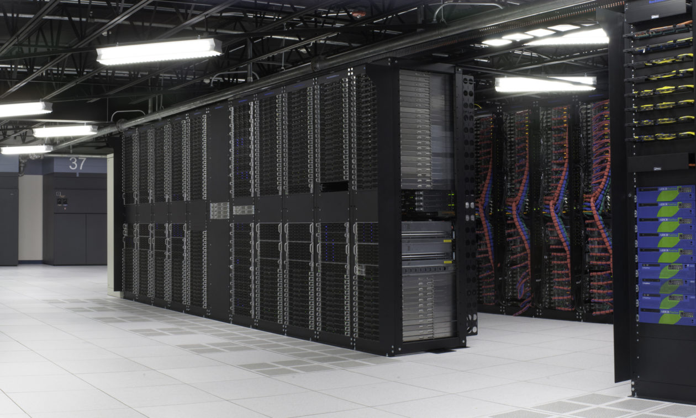
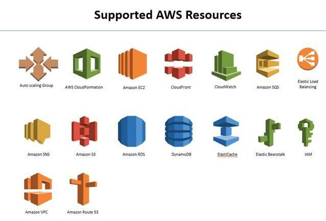

우리회사는 AWS라는 클라우드 서비스를 쓰고 다른 친구개발자는 마이크로소프트서비스의 Azure를 쓴다고 합니다.

AWS는 뭐고 Azure는 뭘까요? 이런걸 **클라우드 서비스**라고 부르던데  

## **왜 대부분의 회사들은 IT리소스들을 클라우드 서비스로 이전하고있고 개발자들은 그에대해서 공부하고 익혀야할까요?**

---

## **예를 들어보겠습니다.**

제가 곱창 장사를 하는데 하루에 손님이 50명이 올것이라고 예상하고 재료를 준비해놨습니다.

하지만 그날 밤에 유명한연예인이 곱창을 너무 맛있게 먹는 바람에 그 다음날 **곱창 대란**이 일어나서 재료가 바닥나서 팔수가없을 지경에 이르렀습니다. 

## \=> 장사실패

어제 난리난 곱창대란을 준비하기위해서 이번엔 500명분을 준비해놨습니다. 

하지만 그날 밤에 먹거리X파일에서 곱창이 우리 몸에 치명적이라는걸 방송에 내보냈습니다. 사람들이 **곱창을 기피**하게되어서 그 다음날 장사는 망했습니다.

## \=> 또 장사실패

이와 같이 인터넷상에서도 비슷한사례가 많이있죠

-   BTS 콘서트 예약
-   카카오톡 서버마비
-   수강신청
-   백신예약

등등...

#### **이 모든것들은 준비한양과 실제 사용량의 불일치에서 일어납니다. **

준비한 양 < 실제 사용량 (고객 불만족)

준비한 양 > 실제 사용량 (자원낭비)

## **그러면 어떻게하면 유연하게 대처할수있을까요?**

바로, 우리가 알아볼 **Cloud Service**를 도입하는것입니다. 

클라우드 서비스를 도입하면, Computing Resource에 대한 **탄력적 대응**이 가능해집니다. 

트래픽이 몰릴때 (곱창대란 일때) ======> 지금 바로 서버구축 1000대 임대

트래픽이 적을떄 (곱창인식이 안좋을때) =====> 서버를 10대로 줄이기

#### **수요에 따라 자원을 탄력적으로 확장이 가능**합니다.

---

## **클라우드 서비스가 가지는 특징 4가지는 다음과 같습니다. **

## **1\. On-Demand**

넷플릭스는 세계최대의  VOD 업체입니다. 여기서 VOD는 Video On Demand의 약자입니다.

#### 온디멘드 (On-Demand)의 사전정 정의는 우리말로 **주문형 서비스** 입니다.

1\. 소비자가  있는 곳까지 찾아가서 상품과 서비스를 전달 하는것

2\. 이용자의  요구에 따라 상품이나 서비스가 바로 제공 되는것

#### 이래도 잘 와닿지 않습니다. 쉽게 풀어보면, **내가 원할때 언제 어디서든 제공이 가능하다** 이런말입니다. 

#### 예를 들어보겠습니다. 

예전에는 비디오를 보려면 비디오방에가서 빌려야했습니다.

가서 보고싶은 비디오가 거꾸로 꽂혀있다면 누가 빌려갔다는 뜻이고 그 비디오가 돌아오기전까지는 빌려 못본다는 뜻이였습니다. 

이렇게 내가 원할때 볼 수 없는게 비디오방 이라면,

넷플릭스는 언제든지 내가 웹사이트를 접속해서 볼수있는 서비스입니다.

#### 이것이 바로 **온디멘드 서비스(On-Demand)이고 비디오로 서비스를 하기때문에 Video-On-Demand 줄여서 VOD 서비스가 되는것**입니다.

#### 글이 길어졌지만, 결국 클라우드 서비스도 **내가원할때 컴퓨팅 서비스를제공을 받을수있는 온디멘드형 서비스**라는 점입니다!

---

## **2\. 대규모 확장성**

#### 첫번째로, 클라우드 사업자가 대규모의 **Computing 자원을 미리 구축해놨기때문에 빌려다 쓰기만 하면**됩니다.

#### 두번째로, **회사가 한국에 있지만 미국에있는 사람들을 대상으로 서비스를하고싶다면,** 해당 리전에있는 컴퓨팅자원을 구축할수도있습니다.

---

## **3\. 종량제 과금**

#### **클****라우드 서비스는 사용한 만큼만 지불합니다.**

**따라서 초기비용에 대한 리스크를 현저히 낮출수있습니다. ****적게 시작해서 점차 늘릴수있고 유연하게 사용할수있습니다.  **

[##_Image|kage@bRdEui/btrbuz5skr3/ALTDyPdIOWKG7iAYT2F5R1/img.png|alignCenter|data-origin-width="475" data-origin-height="250" data-filename="종량제.png" data-ke-mobilestyle="widthOrigin"|||_##]

---

## **4\. 관리 편의성**

#### 서버를 직접 구매, 관리하려면 해당 전문가가 필수적이고 네트워크, 보안등을 직접 설정하고 관리해주어야합니다. 

#### **클라우드 서비스들은 IT자원 관리에 필요한 기능들 제공**하고 있습니다. 

이와 같이 클라우드 컴퓨팅이 가지는 대표적 특징 4가지를 알아보았습니다! 읽어주셔서 감사합니다.

참고:

[https://yslab.kr/63](https://yslab.kr/63)

